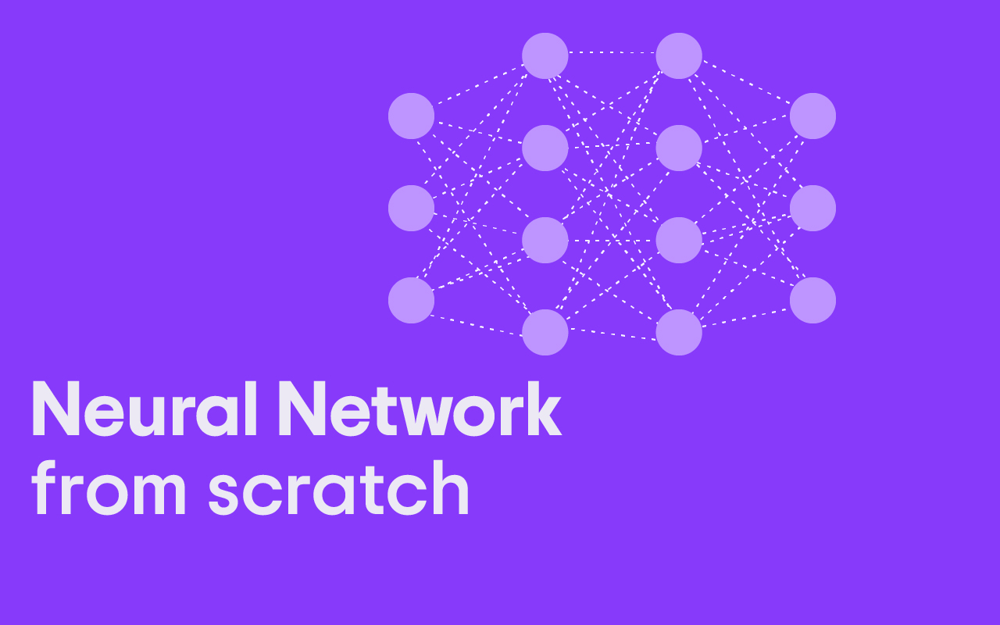

# Neural Network from Scratch in Python



This repository contains the implementation of a neural network built from scratch using Python and NumPy. The project covers core concepts of deep learning, demonstrating how to build, train, and evaluate neural networks without relying on popular machine learning libraries like TensorFlow or PyTorch. It provides a hands-on approach to understanding the internal workings of neural networks.

## Table of Contents

- [About the Project](#about-the-project)
- [Technologies Used](#technologies-used)
- [Installation](#installation)
- [Usage](#usage)
- [Code Structure](#code-structure)
- [How the Network Works](#how-the-network-works)
- [Loss Functions Implemented](#loss-functions-implemented)
- [Training the Network](#training-the-network)
- [Visualizing the Results](#visualizing-the-results)
- [Future Improvements](#future-improvements)


## About the Project

In this project, we implement a simple yet effective feedforward neural network. Starting from the basics, we will gain insights into the math behind the neural networks, including activation functions, weight initialization, forward and backward propagation, and optimization algorithms like gradient descent.

The network can handle tasks such as classification and regression, with examples of how to build custom layers, activation functions, and loss functions.

## Technologies Used

- **Programming Language**: Python 3.x
- **Core Libraries**: NumPy, Matplotlib (for visualizations)
- **Jupyter Notebooks**: Used for step-by-step explanation and demonstration.

## Installation

1. Clone the repository:

   ```bash
   git clone https://github.com/Mayankpratapsingh022/Neural_Network_from_Scratch
   cd https://github.com/Mayankpratapsingh022/Neural_Network_from_Scratch
   ```

2. Install the required dependencies:

   ```bash
   pip install -r requirements.txt
   ```

3. (Optional) Create a virtual environment for better package management:

   ```bash
   python -m venv venv
   source venv/bin/activate  # On Windows: venv\Scripts\activate
   ```

## Usage

To run the neural network and explore its functionalities, open any of the provided Jupyter notebooks (`.ipynb` files):

```bash
jupyter notebook
```

Navigate to the notebook of interest, for example, `4_Network_with_Activation_Fun.ipynb`, and run the cells to see the results.

### Running the Code

You can also run the Python scripts directly from the terminal:

```bash
python 5_Cross_Entropy_Loss.ipynb
```

## Code Structure

The repository contains the following core files and folders:

```
├── 1_Dense_Layer_Class.ipynb       # Dense Layer implementation
├── 2_General_Numpy_Tutorials.ipynb # Numpy basics and tutorials
├── 3_Activation_Function_Scratch.ipynb # Building activation functions from scratch
├── 4_Network_with_Activation_Fun.ipynb # Assembling layers and activations into a network
├── 5_Cross_Entropy_Loss.ipynb      # Implementing cross-entropy loss
├── NeuralNetwork_from_scratch_tut.ipynb # Main notebook explaining the complete neural network
├── requirements.txt                # Project dependencies
└── README.md                       # This file
```

## How the Network Works

The neural network implementation focuses on key steps in deep learning:

1. **Dense Layer**: The `Dense_Layer_Class.ipynb` notebook covers the basics of a dense (fully connected) layer.
2. **Activation Functions**: Implementations of popular activation functions like ReLU, sigmoid, and softmax.
3. **Forward and Backward Propagation**: Mathematical details of forward propagation and calculating gradients during backpropagation.
4. **Loss Functions**: Cross-entropy and mean squared error (MSE) are covered in the `5_Cross_Entropy_Loss.ipynb`.


## Training the Network

The training process is handled through a series of steps:

1. **Initialize weights and biases**.
2. **Feedforward pass**: Compute outputs layer by layer.
3. **Compute the loss**: Based on predictions and actual labels.
4. **Backpropagation**: Update weights using gradient descent.
5. **Optimization**: Implement optimizers like vanilla gradient descent, with room to add more advanced optimizers like Adam or RMSprop.


## Future Improvements

- Implement more advanced optimizers such as Adam and RMSprop.
- Add support for convolutional layers (CNNs).
- Expand to more complex datasets and tasks like MNIST or CIFAR-10.
- Integrate hyperparameter tuning functionality.

